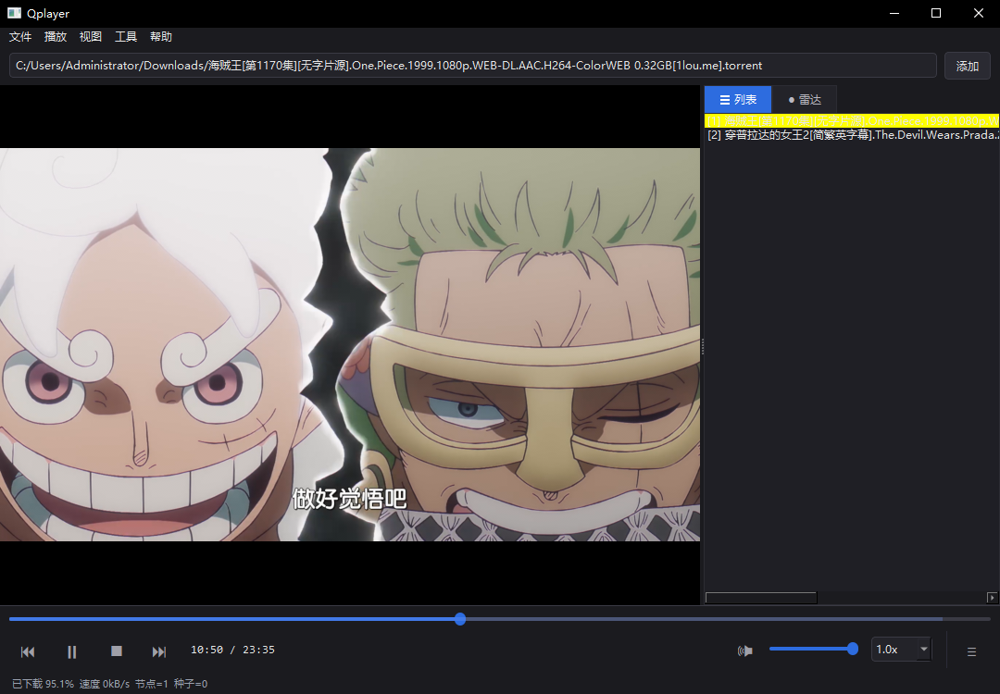

# Qplayer

> P2P 边下边播播放器 — 雷达发现节点，磁力链接，BitTorrent，边下边播

**[English](README.md)** · [下载](https://github.com/lee-baoshan/Qplayer/releases) · [反馈问题](https://github.com/lee-baoshan/Qplayer/issues) · [功能建议](https://github.com/lee-baoshan/Qplayer/issues)

---

---

## ✨ 功能特性

| 功能 | 说明 |
|------|------|
| **P2P 边下边播** | 边下边播，无需等待下载完成即可观看 |
| **磁力链接** | 粘贴 `magnet:?xt=...` 回车即播，无需等待 |
| **雷达** | 自动发现附近及全球正在分享相同内容的节点 |
| **全格式支持** | mkv / mp4 / avi / rmvb 等，配合 FFmpeg 支持更多格式 |
| **播放列表** | 管理多个种子，随时切换 |
| **本地秒开** | 已下载过的资源直接秒播，不走 P2P |
| **自动做种** | 播放后自动继续上传，回馈网络 |
| **字幕** | 自动扫描、拖放加载 `.srt` / `.ass`，支持样式编辑 |
| **色彩校正** | 饱和度 / 对比度 / 亮度 / gamma / 锐化实时调节 |
| **暗色 / 亮色主题** | 一键切换，自动记忆 |
| **自动更新** | 有新版本时自动提示，一键跳转下载 |

---

## 📦 下载安装

**无需 Python。** 下载解压即可使用。

➡️ **[最新版本下载](https://github.com/lee-baoshan/Qplayer/releases/latest)**

### 系统要求

- Windows 10 / 11 x64
- `libmpv-2.dll` 与 `Qplayer.exe` 放在同一目录 — 见 [如何获取 libmpv-2.dll](libs/README.md)
- 可选：[FFmpeg](https://ffmpeg.org/download.html) — rmvb / flv 格式转码（首次启动时如缺少会提示自动下载）
- 可选：[aria2c](https://aria2.github.io) — 下载加速

### 安装步骤

1. 从 Releases 下载 `Qplayer-vX.X.X-windows-x64.zip`
2. 解压到任意目录
3. 将 `libmpv-2.dll` 放入 `Qplayer.exe` 所在目录
4. 运行 `Qplayer.exe`

> **FFmpeg 可选**。如缺少，Qplayer 首次启动时会提示自动下载。

---

## 📡 雷达

雷达自动发现正在分享相同内容的节点——附近局域网内的和全球各地的——并直接连接以获得更快的播放速度。

- 附近节点通过局域网直连，无 DHT 延迟，速度最快
- 全球节点通过 DHT 自动发现，实时同步
- 不显示任何 IP 地址或个人信息

---

## ❤️ 支持项目

如果 Qplayer 对你有帮助，欢迎赞助：

---

## 📄 许可证

预构建版本供个人非商业使用，详见 [LICENSE](LICENSE)。

二进制分发包中使用的第三方组件：

| 组件 | 许可证 |
|------|--------|
| libmpv | LGPL-2.1+ |
| libtorrent | BSD-3-Clause |
| PySide6 | LGPL-3.0 |
| FFmpeg（可选）| LGPL-2.1+ |

**内容免责声明**：本软件不提供、不存储、不索引任何受版权保护的内容，用户自行承担使用责任。
